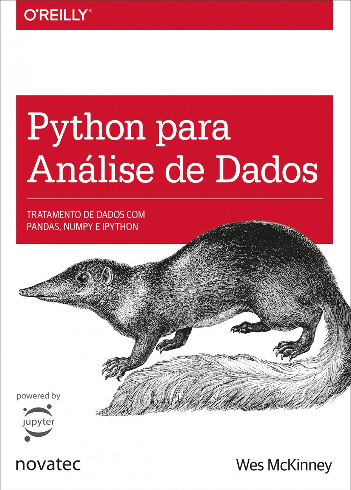

# Scripts para o curso de Aplicação de Python na Agrometeorologia realizado no XXII Congresso Brasileiro de Agrometeorologia - 2023

## Informações gerais sobre o curso

* Curso: Aplicação de Python na Agrometeorologia.
* Ministrante: Dr. Guilherme Martins - jgmsantos@gmail.com.
* Dia 1: 30/11/2022.
  * Duração: 2 horas (16h00-18h00).
* Dia 2: 01/12/2022.
  * Duração: 2horas (16h00-18h00).
* Local: Fundeb - Sala Urano.

## Conteúdo programático

* Biblioteca xarray para abrir, manipular e processar arquivos no formato NetCDF (nome do script: ```xarray.ipynb```)
* Geração de figuras (nome do script: ```graficos.ipynb```)
  * Gráfico de linha
  * Gráfico de barra
  * Gráfico espacial
  * Uso do shapefile
    * Adicionar shapefile ao mapa
    * Uso do shapefile para mascarar o dado
* Criação de painel complexo para geração de figuras (nome do script: ```gridspec.ipynb```)

## Recomendação de leitura

O livro **Python Para Análise de Dados: Tratamento de Dados com Pandas, NumPy e IPython** é uma excelente porta de entrada para quem deseja se tornar cientista de dados.

Link para comprar o livro: 

[Link para Amazon](https://www.amazon.com.br/Python-Para-An%C3%A1lise-Dados-Tratamento/dp/8575226479/ref=sr_1_6?crid=3IQMCPU8VU8AG&keywords=python+para+analise+de+dados&qid=1693326265&sprefix=Python+para+Analise+de+Dados%2Caps%2C268&sr=8-6)



## Material de apoio

* [Aplicações de Python em Geociências](https://drive.google.com/file/d/15_62F9lb21XDhCsYL_YoKIuuAATNWpNw/view)
* [https://guilherme.readthedocs.io/en/latest/pages/tutoriais/python.html](https://guilherme.readthedocs.io/en/latest/pages/tutoriais/python.html)

## Rede sociais

* [Minha página](https://guilherme.readthedocs.io/en/latest)
* [Canal no Youtube](https://www.youtube.com/c/CursosLibertatem)
* [Instagram](https://www.instagram.com/cursos.libertatem)
* [GitHub](https://github.com/jgmsantos)

## Criação do ambiente virtual
* Para criar um ambiente virtual para quem usa conda, basta digitar o comando abaixo. E para quem não usa, basta seguir para o próximo item de instalação de bibliotecas.

```conda create -n cbagro python=3.9.12```

## Instalação de bibliotecas

```pip3 install --upgrade pip```

```pip install fastai==2.5.6```

```pip install matplotlib==3.4.3```

```pip install ipykernel```

```conda install -c conda-forge xarray dask netCDF4 bottleneck```

```pip install regionmask```

```pip install geopandas==0.10.2```

```pip install seaborn``` --< ultima lib instalada 25/08/2023

```pip install proplot==0.9.4```

```conda install -c conda-forge cartopy```

```pip install rasterio==1.2.10```

```pip install salem==0.3.7```

```pip install pygeos==0.12.0```

```pip install rtree==1.0.0```

```conda install -c conda-forge ncview```

## Frase motivacional

* Sabemos muitos, mas não sabemos tudo.


## Anotações

- tabela 5.8, pag 211
- cap. 11.7, pag 438
- tabela 11.4, pag 406
- pag 292, junções no dataframe