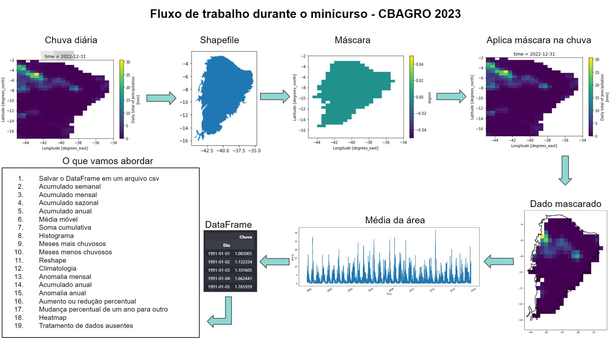
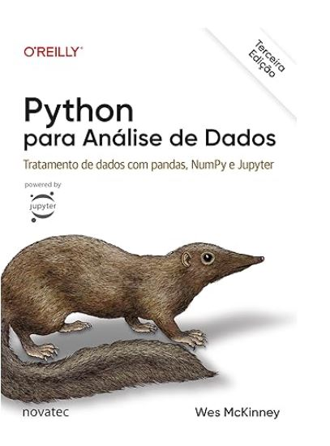
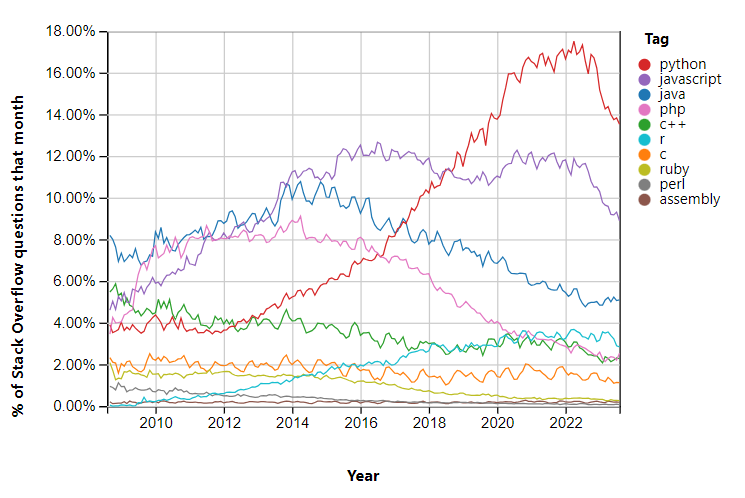
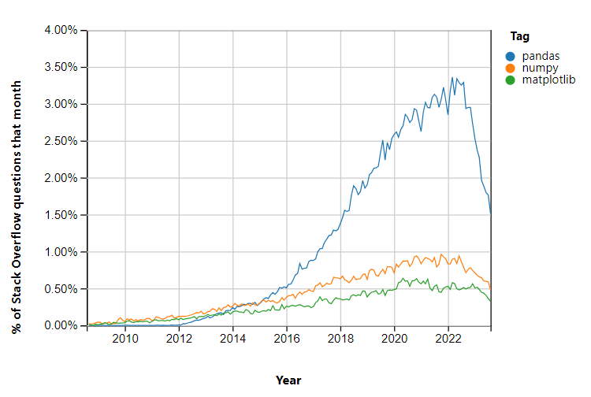

# Scripts para o curso de Aplicação de Python na Agrometeorologia realizado no XXII Congresso Brasileiro de Agrometeorologia - outubro de 2023

## Informações gerais sobre o curso

* Curso: Aplicação de Python na Agrometeorologia.
* Ministrante: Dr. Guilherme Martins - jgmsantos@gmail.com.
* Dia 1: 03/10/2022.
  * Duração: 1h30m (17h30-19h00).
* Dia 2: 04/10/2022.
  * Duração: 1h30m (17h30-19h00).
* Dia 3: 05/10/2022.
  * Duração: 1h30m (17h30-19h00).
* Carga horária: 4h30min.

## Conteúdo programático



## Recomendação de leitura

O livro **Python Para Análise de Dados: Tratamento de Dados com Pandas, NumPy & Jupyter** é uma excelente porta de entrada para quem deseja se tornar cientista de dados.

Link para comprar o livro. **No dia 27/09/2023 o valor era de R$ 139,05**. 

[Link para Amazon](https://www.amazon.com.br/Python-Para-An%C3%A1lise-Dados-Tratamento/dp/8575228412/ref=sr_1_1?__mk_pt_BR=%C3%85M%C3%85%C5%BD%C3%95%C3%91&crid=1G73UGM7TMGFI&keywords=Python+Para+An%C3%A1lise+de+Dados%3A+Tratamento+de+Dados+com+Pandas%2C+NumPy+e+IPython&qid=1695821092&sprefix=python+para+an%C3%A1lise+de+dados+tratamento+de+dados+com+pandas+numpy+e+ipython%2Caps%2C241&sr=8-1&ufe=app_do%3Aamzn1.fos.6d798eae-cadf-45de-946a-f477d47705b9)



## Crescimento do Python



Fonte: [stackoverflow](https://insights.stackoverflow.com/trends?tags=java%2Cc%2Cc%2B%2B%2Cpython%2Cjavascript%2Cassembly%2Cphp%2Cperl%2Cruby%2Cr)

## Bibliotecas Python mais utilizadas



Fonte: [stackoverflow](https://insights.stackoverflow.com/trends?tags=pandas%2Cnumpy%2Cmatplotlib)

## Material de apoio

* [Aplicações de Python em Geociências](https://drive.google.com/file/d/15_62F9lb21XDhCsYL_YoKIuuAATNWpNw/view)
* [https://guilherme.readthedocs.io/en/latest/pages/tutoriais/python.html](https://guilherme.readthedocs.io/en/latest/pages/tutoriais/python.html)

## Rede sociais

* [Minha página](https://guilherme.readthedocs.io/en/latest)
* [Canal no Youtube](https://www.youtube.com/c/CursosLibertatem)
* [Instagram](https://www.instagram.com/cursos.libertatem)
* [GitHub](https://github.com/jgmsantos)

## Criação do ambiente virtual
* Para criar um ambiente virtual para quem usa conda, basta digitar o comando abaixo. E para quem não usa, seguir para o próximo item de instalação de bibliotecas.

```conda create -n cbagro python=3.9.12```

## Instalação de bibliotecas

```pip3 install --upgrade pip```

```pip install fastai==2.5.6```

```pip install matplotlib==3.4.3```

```pip install ipykernel```

```conda install -c conda-forge xarray dask netCDF4 bottleneck```

```pip install regionmask```

```pip install geopandas==0.10.2```

## Frase motivacional

* Sabemos muitos, mas não sabemos tudo.